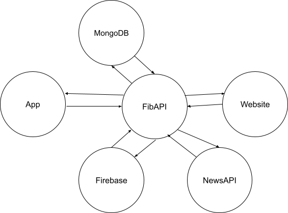

# Fibonia

Welcome to Fibonia's GitHub repository, a service that aggregates information from multiple sources onto a single feed, giving users a stream of curated, relevant and fact-checked information on the topics they're passionate about, and helping those looking to explore something new do so with minimal time spent on research.

#### **Directory :**
* [Website Directory](https://github.com/Fibonia/FiboniaWebsite) - Fibonia's repository for the website
* [iOS App Directory](https://github.com/Fibonia/FiboniaApp) - Fibonia's repository for the iOS app
* [Backend Server Directory](https://github.com/Fibonia/FiboniaServer) - Fibonia's repository for running backend processes such as user authentication, database services, information aggregation, OCR, etc.
* [Skeleton Directory](https://github.com/Fibonia/FiboniaSkeleton) - Fibonia's repository with Skeleton codes for interns to work on.
* [OCR Directory](https://github.com/Fibonia/OCR) - Fibonia's repository for the Optical Character Recognition system.

#### **System Overview :**

  

## How It Works

1. The Fibonia website and iOS app can simultaneously contact Firebase's User authentication system to enable a successful login along with access to the content platform. 
2. Affter having successfully logged in to the respective platforms, FibAPI will help and retrieve synchronized information of the user to both platforms, thus enabling Fibonia to present relevant and curated sources of information that tend to their favored topics. 
3. For FibAPI to achieve this, it will contact the MongoDB database to retrieve the topics (along with favored sources of information) of the user, which will then use this information to feed the topics to our AI module.
4. Our AI module will return with the most up-to-date URLs of content to present the user and then be sent back as a message to the respective platforms, hence updating the platform feed.
